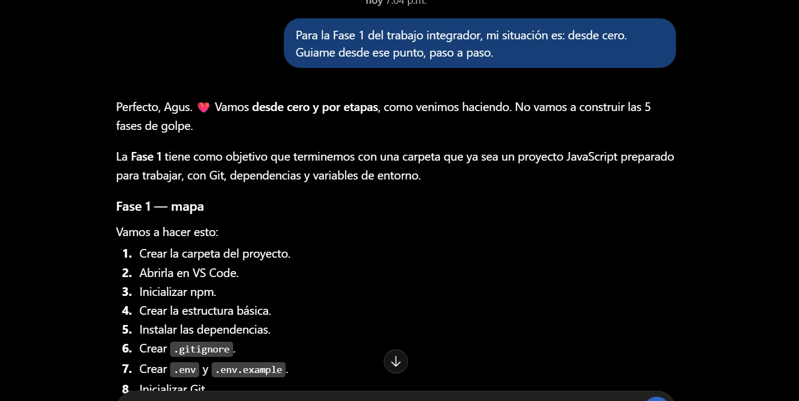
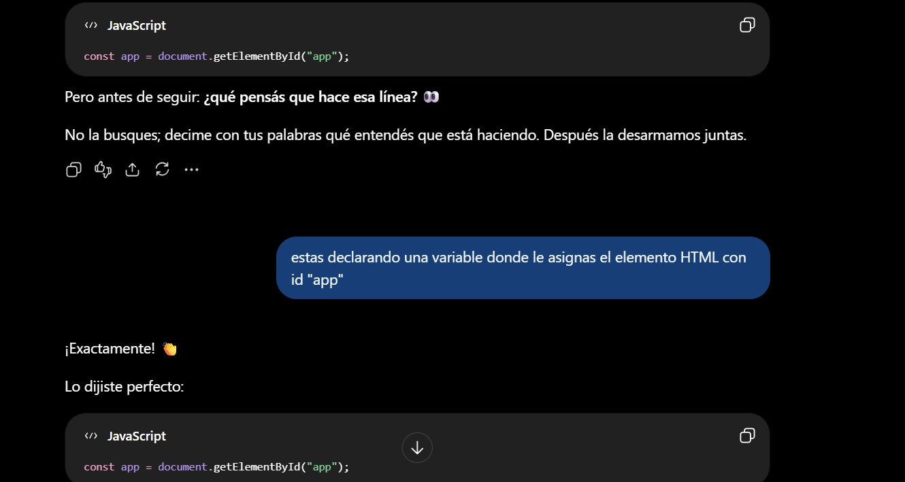
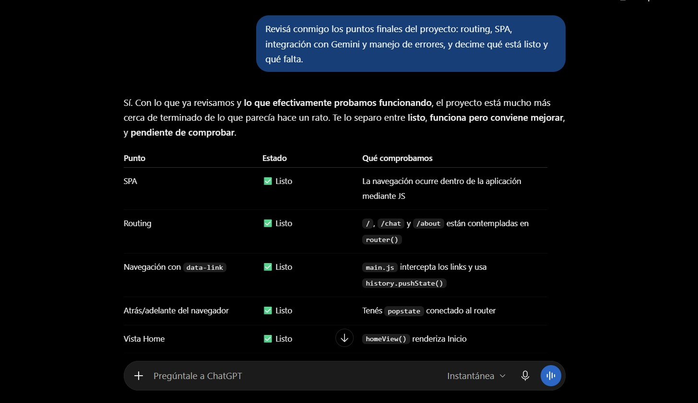
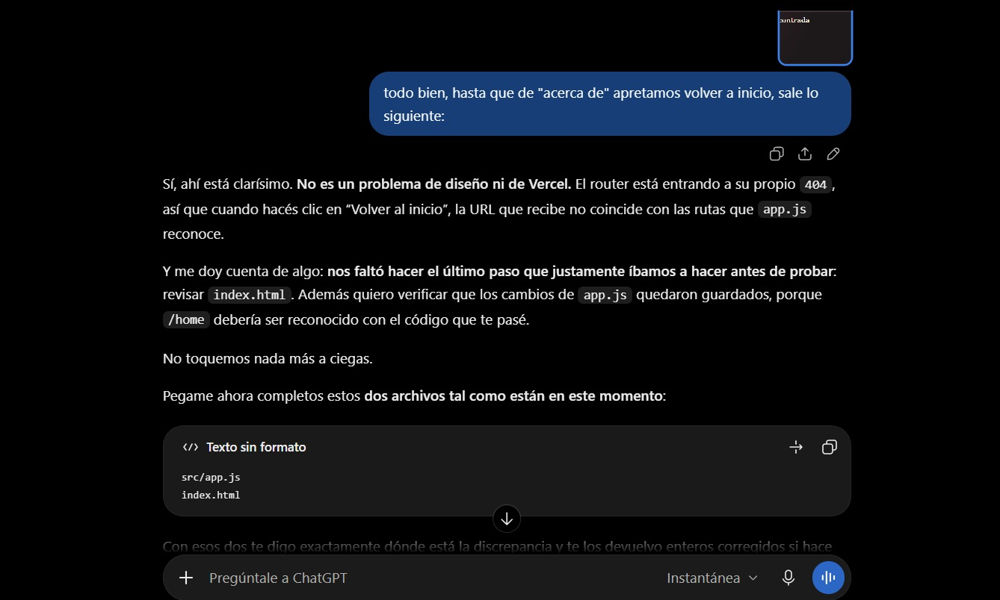

# Registro del uso de Inteligencia Artificial

## Proyecto Integrador M3 — Chat de Estrellas

Durante el desarrollo del Proyecto Integrador M3 utilicé ChatGPT como herramienta de apoyo para comprender conceptos, planificar la implementación, resolver errores, revisar código y documentar el proyecto.

La IA fue utilizada como acompañamiento durante el proceso de desarrollo. Las soluciones propuestas fueron implementadas y probadas localmente antes de incorporarlas al proyecto.

---

## 1. Planificación de la aplicación

### Consulta realizada

Se solicitó ayuda para analizar los requisitos del Proyecto Integrador y organizar la aplicación como una SPA con diferentes vistas.

### Trabajo realizado

Se definió una estructura basada en:

- Una vista Home.
- Una vista Chat.
- Una vista About.
- Navegación mediante History API.
- Una Serverless Function para comunicarse con Gemini.
- Funciones auxiliares para transformar datos.
- Tests unitarios con Vitest.

También se analizó qué funcionalidades eran obligatorias y cuáles podían incorporarse como extras.

### Decisión tomada

Se decidió mantener una estructura simple, separando la lógica general de la aplicación, las vistas, los estilos y la comunicación con la API.

---

## 2. Diseño e interfaz

### Consulta realizada

Se solicitó asistencia para desarrollar una identidad visual propia para la aplicación y adaptar la interfaz a diferentes tamaños de pantalla.

### Trabajo realizado

Se trabajó sobre una estética inspirada en el espectáculo y las figuras populares argentinas.

Se utilizaron tonos oscuros, bordó, crema y detalles dorados, junto con tarjetas para representar a cada personaje.

También se implementaron:

- Tema claro y oscuro.
- Selector visual de personajes.
- Diferenciación entre mensajes del usuario y del personaje.
- Estados visuales durante la espera de una respuesta.
- Adaptación responsive.

### Decisión tomada

Se eligió mantener una estética teatral y reconocible en lugar de utilizar una interfaz genérica de chat.

---

## 3. Navegación SPA

### Consulta realizada

Se solicitó orientación para implementar diferentes rutas sin realizar una recarga completa de la página.

### Trabajo realizado

Se utilizó la History API del navegador mediante:

- `history.pushState()`
- Evento `popstate`
- Atributos `data-link`

Se configuraron las siguientes rutas:

- `/home`
- `/chat`
- `/about`

Durante las pruebas se detectó que inicialmente la página principal solamente era reconocida mediante `/`.

### Problema encontrado

Al modificar el enlace de inicio para utilizar `/home`, la aplicación mostraba:

`404 - Página no encontrada`

### Solución

Se agregó `/home` entre las rutas reconocidas por el router y se actualizaron los enlaces internos para utilizar la misma ruta.

---

## 4. Creación de personajes

### Consulta realizada

Se solicitó ayuda para implementar diferentes personajes dentro de una misma aplicación de chat.

### Trabajo realizado

Se crearon tres personajes:

- Sandro.
- Moria Casán.
- Susana Giménez.

Cada personaje posee:

- Nombre.
- Saludo inicial.
- Placeholder personalizado.
- `systemPrompt` propio.

Los prompts fueron utilizados para indicar a Gemini el tono y estilo esperado para cada conversación.

### Decisión tomada

Se decidió incorporar tres personajes para aprovechar el extra propuesto en la consigna y ofrecer una experiencia más dinámica.

---

## 5. Integración con Google Gemini

### Consulta realizada

Se solicitó orientación para conectar el chat con Google Gemini sin exponer la API key en el frontend.

### Trabajo realizado

La comunicación con Gemini se implementó mediante una Vercel Serverless Function ubicada en:

`api/chat.js`

La API key se obtiene desde:

`process.env.GEMINI_API_KEY`

De esta manera, la clave no se incluye directamente en el código JavaScript ejecutado por el navegador.

### Seguridad

El archivo `.env` fue agregado a `.gitignore`.

También se creó:

`.env.example`

con la variable:

`GEMINI_API_KEY=`

sin incluir ningún valor real.

---

## 6. Manejo de errores de Gemini

### Problema encontrado

Durante las pruebas de la integración aparecieron respuestas `503`, indicando que el modelo se encontraba temporalmente con alta demanda.

### Trabajo realizado

Se implementó un sistema de reintentos para errores temporales antes de mostrar un mensaje de error al usuario.

Posteriormente también apareció un error `429 RESOURCE_EXHAUSTED`.

### Análisis realizado

Se revisó el mensaje devuelto por Gemini y se determinó que se había alcanzado la cuota disponible de solicitudes para el modelo utilizado.

Esto permitió diferenciar un problema de disponibilidad temporal (`503`) de un límite de cuota (`429`).

### Decisión tomada

Se evitó continuar realizando solicitudes innecesarias a la API y se continuó trabajando en partes del proyecto que no dependían de Gemini.

---

## 7. Historial y contexto de conversación

### Consulta realizada

Se solicitó ayuda para lograr que Gemini pudiera recibir el contexto de los mensajes anteriores de la conversación.

### Trabajo realizado

Se creó una función:

`formatHistoryForGemini()`

que transforma el historial interno de la aplicación al formato esperado por Gemini.

Los mensajes del usuario utilizan:

`role: "user"`

y las respuestas del personaje:

`role: "model"`

El frontend mantiene el historial durante la sesión y lo envía junto con las nuevas solicitudes.

### Estado de la prueba

La implementación fue completada. Durante la prueba final se alcanzó el límite de cuota de Gemini, por lo que la validación definitiva del contexto quedó pendiente hasta la renovación de la cuota disponible.

---

## 8. Scroll automático y experiencia del chat

### Trabajo realizado

Se implementó scroll automático para mantener visible el mensaje más reciente.

También se incorporó un mensaje temporal de espera mientras se procesa la respuesta de Gemini.

El formulario permite enviar mensajes mediante el botón de envío o presionando Enter.

---

## 9. Tests unitarios con Vitest

### Consulta realizada

Se solicitó ayuda para configurar los tests requeridos por la consigna.

### Problema inicial

Vitest estaba instalado, pero el proyecto todavía conservaba el script predeterminado:

`"test": "echo \"Error: no test specified\" && exit 1"`

y no existían archivos de tests.

### Solución

Se configuró:

`"test": "vitest run"`

y se creó:

`src/tests/utils.test.js`

### Tests realizados

Se implementaron 5 tests unitarios para comprobar:

1. Eliminación de espacios mediante `cleanInputText`.
2. Manejo de valores que no son strings.
3. Conversión de mensajes del usuario al formato de Gemini.
4. Conversión de respuestas del personaje al rol `model`.
5. Manejo de un historial inválido.

### Resultado

La ejecución final produjo:

`Test Files: 1 passed`

`Tests: 5 passed`

---

## 10. Pruebas responsive

### Consulta realizada

Se solicitó revisar si la aplicación cumplía con el requisito responsive antes de realizar modificaciones adicionales en CSS.

### Trabajo realizado

Se utilizó el modo responsive de DevTools para revisar la aplicación en diferentes anchos.

Se probaron:

- 375 px — móvil.
- 768 px — tablet.
- 1024 px — escritorio.

### Resultado

La interfaz se adaptó correctamente en los tres tamaños sin presentar desbordamientos horizontales importantes ni elementos inutilizables.

No fue necesario realizar cambios adicionales en CSS durante esta etapa.

---

## 11. Deployment en Vercel

### Consulta realizada

Se solicitó orientación para desplegar la aplicación y verificar el funcionamiento de las Serverless Functions.

### Trabajo realizado

El deployment de producción se realizó mediante:

`npx vercel --prod`

La aplicación quedó disponible mediante una URL pública de Vercel.

También se verificó el acceso desde otros dispositivos.

---

## 12. Error 404 al acceder directamente a rutas

### Problema encontrado

Aunque la navegación interna de la SPA funcionaba correctamente, al ingresar directamente a una ruta como:

`/chat`

o recargar esa página en producción, Vercel mostraba un error 404.

### Análisis realizado

La navegación interna era controlada por JavaScript, pero al acceder directamente a la URL Vercel intentaba encontrar un recurso físico correspondiente a esa ruta.

### Solución

Se configuraron rewrites específicos en `vercel.json` para:

- `/home`
- `/chat`
- `/about`

Las rutas fueron redirigidas internamente a `index.html`, permitiendo que el router de la SPA determine qué vista mostrar.

Se evitó utilizar un rewrite global porque durante las pruebas locales una configuración de ese tipo también interceptaba recursos utilizados por Vite.

La ruta `/api/chat` quedó fuera de los rewrites para permitir que la Serverless Function continuara funcionando normalmente.

### Resultado

Después de realizar un nuevo deployment se verificó que las rutas podían abrirse directamente y recargarse sin producir un error 404.

---

## 13. Documentación del proyecto

### Consulta realizada

Se utilizó ChatGPT como apoyo para organizar la documentación final de acuerdo con los requisitos de entrega.

### Trabajo realizado

Se prepararon:

- README del proyecto.
- Registro del uso de IA.
- Estructura para capturas de pantalla.
- Instrucciones de instalación.
- Configuración de variables de entorno.
- Instrucciones para tests.
- Instrucciones de deployment.

---

## Conclusión

El uso de IA durante este proyecto estuvo orientado principalmente al aprendizaje, análisis de errores, revisión de alternativas y acompañamiento durante la implementación.

Las respuestas proporcionadas por la IA fueron contrastadas mediante pruebas en el navegador, DevTools, la terminal, Vitest y el deployment de Vercel.

Las decisiones finales sobre estructura, diseño y funcionalidades se tomaron durante el desarrollo y se verificaron directamente sobre la aplicación.

---

## Evidencias del uso de IA

A continuación se incluyen algunas capturas del proceso de trabajo con ChatGPT durante el desarrollo del proyecto. Estas evidencias muestran distintos usos de la IA como herramienta de acompañamiento, aprendizaje, revisión y resolución de problemas.

### 1. Planificación inicial del proyecto

Al comienzo del proyecto se utilizó ChatGPT para analizar la consigna y organizar el trabajo por etapas, partiendo desde la creación y configuración inicial del proyecto.

### 2. Acompañamiento en el aprendizaje de JavaScript

La IA también se utilizó para comprender el funcionamiento del código. Durante el proceso se realizaron preguntas y ejercicios de interpretación antes de continuar con la implementación.

### 3. Revisión de requisitos y estado del proyecto

En etapas posteriores se utilizó ChatGPT para revisar el estado de los requisitos de la consigna, incluyendo la estructura SPA, el routing, la navegación mediante History API y otras funcionalidades pendientes.

### 4. Resolución de errores y debugging

La IA se utilizó como apoyo para analizar errores concretos durante el desarrollo. Por ejemplo, se revisó un problema de routing que provocaba un error 404 al intentar regresar a la vista Home desde la sección Acerca de.

---

Estas capturas representan ejemplos del uso de IA durante distintas etapas del desarrollo. Las soluciones propuestas fueron revisadas, implementadas y probadas directamente en el proyecto antes de considerarlas finalizadas.

