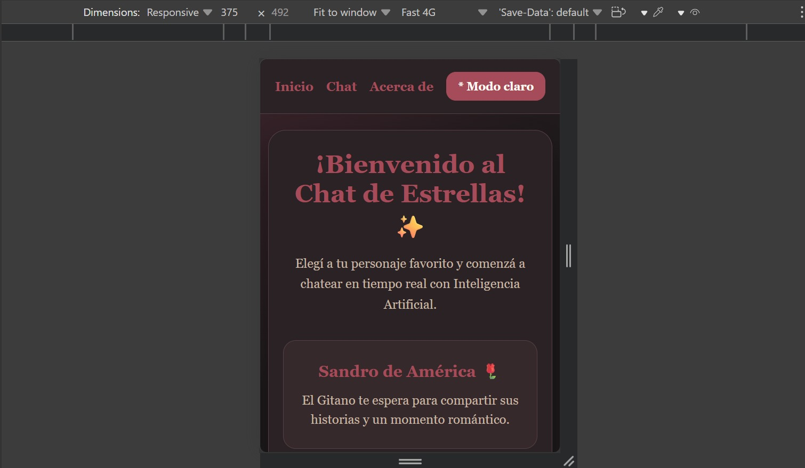
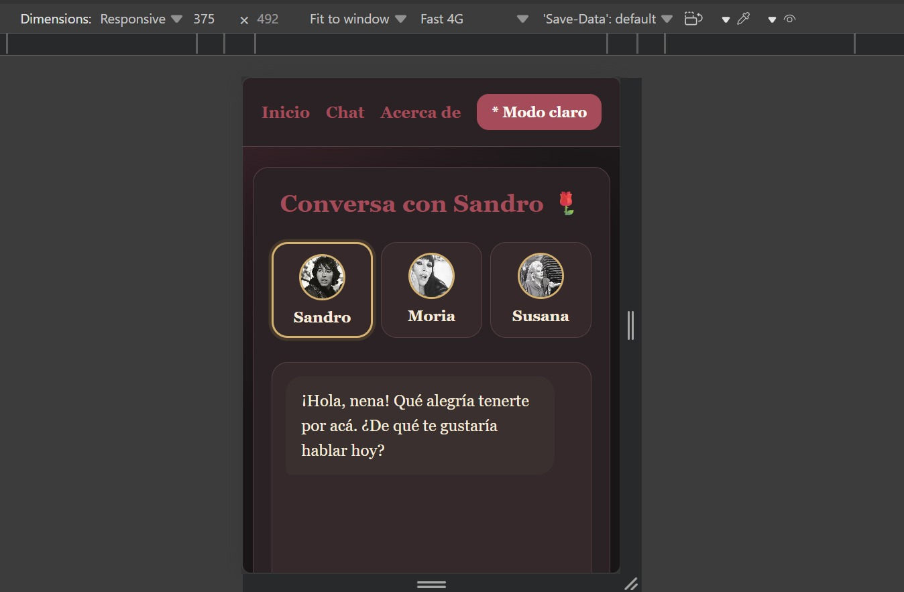
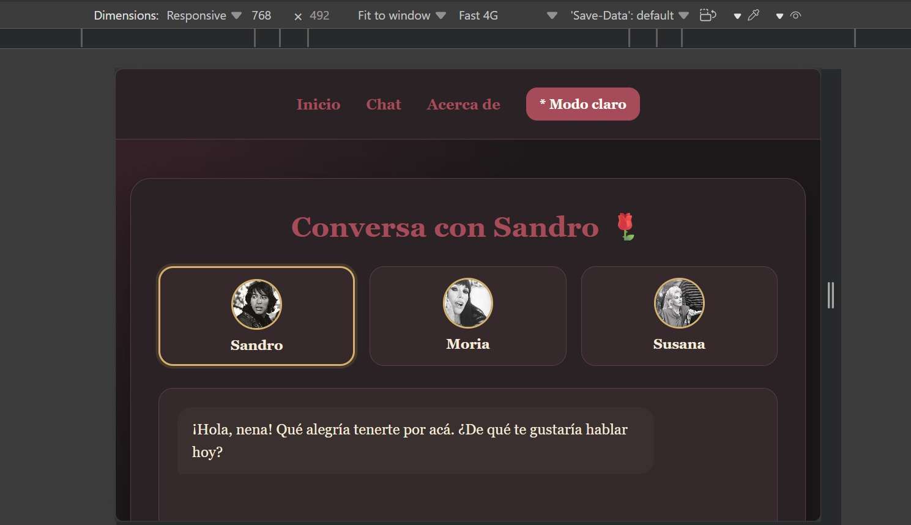
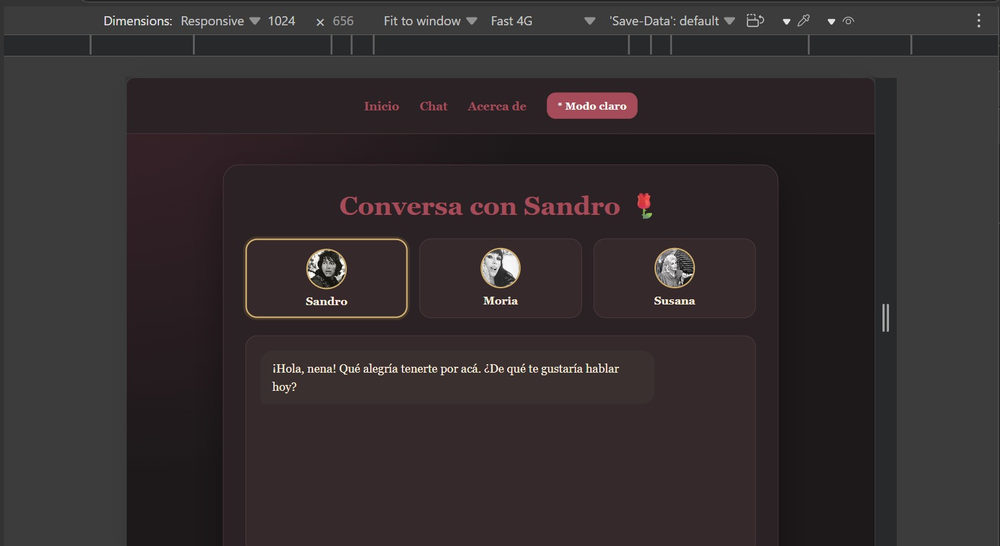
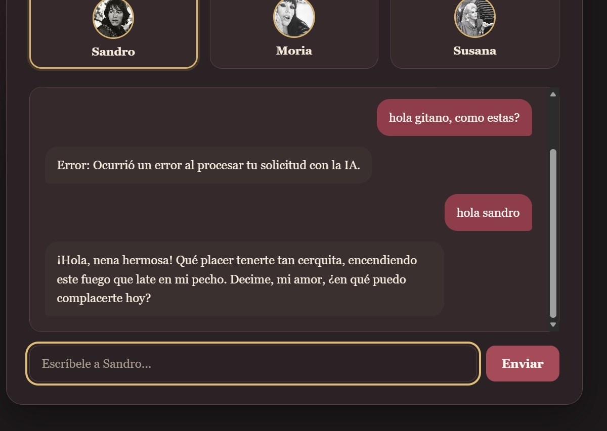

# Chat de Estrellas ✨

Proyecto Integrador M3 desarrollado como parte de la formación Full Stack de Soy Henry.

Chat de Estrellas es una aplicación web SPA que permite conversar con personajes inspirados en figuras populares argentinas mediante Inteligencia Artificial. La aplicación utiliza Google Gemini para generar las respuestas y Vercel Serverless Functions para realizar las solicitudes a la API sin exponer la clave en el frontend.

## Personajes

La aplicación permite elegir entre tres personajes, cada uno con su propia personalidad y contexto definido mediante un `systemPrompt`.

### Sandro de América 🌹

Inspirado en Roberto Sánchez, Sandro responde con un estilo romántico, cálido y característico del cantante.

### Moria Casán 👑

Inspirada en Moria Casán, responde de manera directa, divertida y con expresiones características de "La One".

### Susana Giménez ✨

Inspirada en Susana Giménez, responde con un tono entusiasta, espontáneo y expresiones asociadas a la conductora.

El usuario puede cambiar de personaje desde el selector disponible en la vista del chat.

## Funcionalidades

- Aplicación SPA (Single Page Application).
- Navegación mediante History API sin recargar la página.
- Rutas `/home`, `/chat` y `/about`.
- Integración con Google Gemini.
- Vercel Serverless Function para proteger la API key.
- Tres personajes con diferentes `systemPrompt`.
- Historial de conversación durante la sesión.
- Manejo de errores de la API.
- Estado visual mientras se espera la respuesta de la IA.
- Scroll automático del chat.
- Tema claro y oscuro.
- Diseño responsive para móvil, tablet y escritorio.
- Tests unitarios realizados con Vitest.

## Tecnologías utilizadas

- HTML5
- CSS3
- JavaScript
- Vite
- Vitest
- Google Gemini API
- Vercel Functions
- Vercel

## Estructura principal del proyecto

```text
ProyectoM3_AgustinaPedernera/
│
├── api/
│   └── chat.js
│
├── src/
│   ├── styles/
│   │   └── styles.css
│   ├── tests/
│   │   └── utils.test.js
│   ├── views/
│   │   ├── about.js
│   │   ├── chat.js
│   │   └── home.js
│   ├── app.js
│   ├── main.js
│   └── utils.js
│
├── Documentacion/
│   ├── capturas/
│   └── uso-ia.md
│
├── .env.example
├── .gitignore
├── index.html
├── package.json
├── README.md
└── vercel.json
```

## Requisitos para ejecutar el proyecto

Es necesario tener instalado:

- Node.js
- npm
- Vercel CLI
- Una API key de Google Gemini

## Instalación y ejecución local

### 1. Clonar el repositorio

```bash
git clone https://github.com/AgustinaPedernera/ProyectoM3_AgustinaPedernera.git
```

Ingresar a la carpeta del proyecto:

```bash
cd ProyectoM3_AgustinaPedernera
```

### 2. Instalar las dependencias

```bash
npm install
```

### 3. Configurar las variables de entorno

El proyecto incluye un archivo `.env.example` con la variable necesaria:

```env
GEMINI_API_KEY=
```

Crear un archivo `.env` en la raíz del proyecto y agregar la API key:

```env
GEMINI_API_KEY=TU_API_KEY
```

El archivo `.env` está incluido en `.gitignore` para evitar publicar la clave.

### 4. Ejecutar la aplicación localmente

Como el proyecto utiliza una Vercel Serverless Function, debe ejecutarse localmente mediante:

```bash
npx vercel dev
```

Una vez iniciado el servidor, abrir en el navegador la dirección indicada por Vercel CLI.

> En Windows/PowerShell, si la ejecución de los comandos estándar está restringida, pueden utilizarse `npm.cmd` y `npx.cmd`.

## Tests unitarios

Los tests fueron realizados con Vitest.

Para ejecutarlos:

```bash
npm test
```

Actualmente el proyecto cuenta con 5 tests unitarios sobre las funciones de utilidad utilizadas por la aplicación.

Los tests verifican:

- Limpieza de texto mediante `cleanInputText`.
- Manejo de valores que no son texto.
- Transformación de mensajes del usuario al formato requerido por Gemini.
- Transformación de respuestas del personaje al rol `model`.
- Manejo de un historial inválido.

## Despliegue en Vercel

Para realizar un deployment de producción desde Vercel CLI:

```bash
npx vercel --prod
```

En el proyecto de Vercel también debe configurarse la variable de entorno:

```env
GEMINI_API_KEY
```

La configuración de `vercel.json` incluye rewrites para las rutas de la SPA, permitiendo acceder o recargar directamente `/home`, `/chat` y `/about` sin obtener un error 404.

La ruta `/api/chat` queda reservada para la Serverless Function que realiza la comunicación con Gemini.

## Aplicación desplegada

La aplicación se encuentra disponible públicamente en Vercel:

https://proyecto-m3-agustina-pedernera.vercel.app

## Capturas de pantalla

### Vista Home — versión móvil

La página principal presenta la aplicación y permite acceder al chat.



### Chat — versión móvil

La interfaz se adapta a pantallas pequeñas manteniendo disponible el selector de personajes y el área de conversación.



### Chat — versión tablet

La aplicación fue probada también en un ancho intermedio para verificar la adaptación responsive.



### Chat — versión escritorio

En pantallas de escritorio, el chat mantiene los personajes, mensajes y controles organizados dentro del contenedor principal.



### Integración con Gemini

Durante las pruebas se verificó la recepción de respuestas generadas por Gemini desde la Serverless Function.



## Uso de Inteligencia Artificial durante el desarrollo

Durante el desarrollo del proyecto se utilizó ChatGPT como herramienta de apoyo.

La IA fue utilizada principalmente para:

- Comprender y planificar la estructura de la SPA.
- Resolver dudas relacionadas con JavaScript y routing.
- Analizar errores durante la integración con Gemini.
- Implementar y revisar el historial de conversación.
- Comprender errores `429` y `503` provenientes de la API.
- Configurar y probar las Vercel Serverless Functions.
- Resolver el acceso directo y la recarga de las rutas de la SPA en producción.
- Crear y revisar tests unitarios con Vitest.
- Revisar el comportamiento responsive de la aplicación.
- Organizar la documentación del proyecto.

El código y las soluciones fueron probados durante el desarrollo antes de incorporarlos al proyecto.

El registro detallado y las evidencias del uso de IA se encuentran en:

[Documentacion/uso-ia.md](./Documentacion/uso-ia.md)

## Autora

**Agustina Pedernera**

Proyecto Integrador M3 — Soy Henry